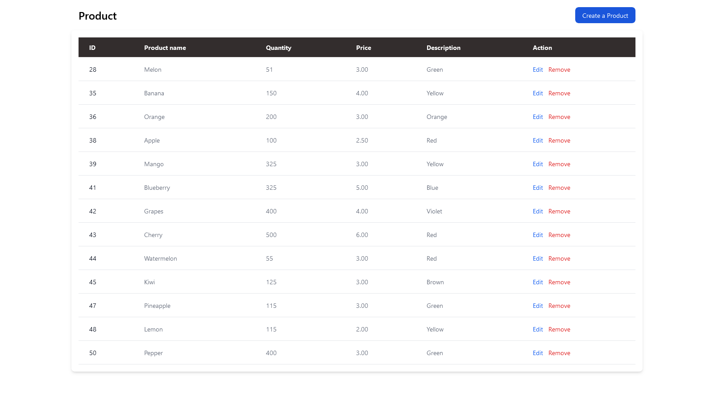
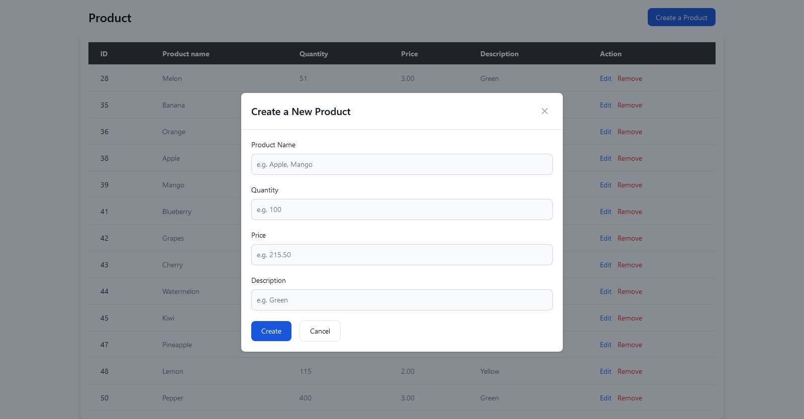
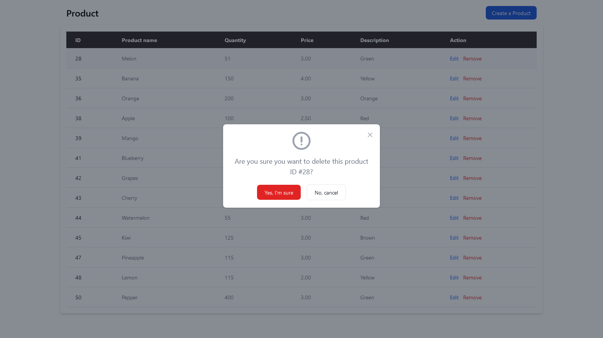

# Product Table CRUD Application with Laravel Breeze Authentication

This project is a simple CRUD (Create, Read, Update, Delete) application for managing product data. It incorporates Laravel Breeze authentication for user management.

## Overview

The Product Table CRUD application allows authenticated users to perform the following operations:

-   Create new products
-   Read existing product information
-   Update product details
-   Delete products from the database

## Features

-   **Create**: Authenticated users can add new products to the database with relevant details such as name, description, price, and quantity.
-   **Read**: Display a list of existing products along with their details.
-   **Update**: Authenticated users can modify the information of existing products, including their name, description, price, and quantity.
-   **Delete**: Authenticated users can remove products from the database.

## Screenshots

Below are screenshots of the application:

1. : Main interface displaying the list of products.
2. : Adding a new product to the database.
3. ): Updating product details.
4. : Deleting a product from the database.

## Installation

To run the application locally, follow these steps:

1. Clone this repository to your local machine.

```
git clone https://github.com/your_username/product-table-crud.git
```

2. Navigate to the project directory.

```
cd laravel-crud
```

3. Install the necessary dependencies.

```
composer install
npm install
```

4. Copy the `.env.example` file and rename it to `.env`. Configure your database settings and other necessary environment variables in this file.

5. Generate application key.

```
php artisan key:generate
```

7. Install Laravel Breeze for authentication.

```
php artisan breeze:install
npm install && npm run dev
```

8. Start the Laravel development server.

```
php artisan serve
```
